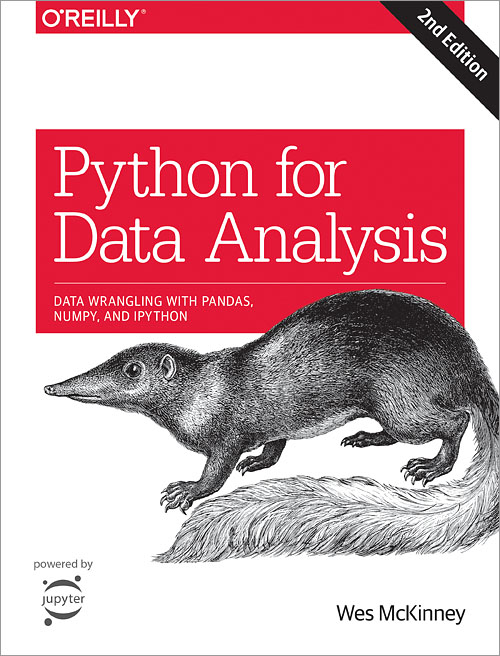

# Data Analysis

# ট্রপিক :
## Chapter-2. Python language basics, IPython and Jupyter Notebook
* The python interpreter
* IPython basics
* Python basics

## Chapter-3. Built-in Data structures. Functions and Files
* Data structures and sequences
* Functions
* Files and operating system

## Chapter-4. Numpy basics: Arrays and vectorized computation
* The Numpy ndarray: A Multidimensional array object
* Universal functions: Fast Element-wise array functions
* Array-oriented programming with arrays
* File input and output with arrays
* Linear algebra
* Pseudorandom number generation

## Chapter-5. Getting started with pandas
* Introduction to pandas data structures
* Essential functionality
* Summarizing and computing descriptive statistics

## Chapter-6. Data Loading, Storage and File Formats
* Reading and writing data in text format
* Binary data formats
* Interacting with Databases

## Chapter-7. Data Cleaning and Preparation
* Handling missing data
* Data transformation
* String manipulation

## Chapter-8. Data wrangling: Join, Combine and Reshape
* Hierarchical indexing
* Combining and merging datasets
* Reshaping and pivoting

## Chapter-9. Plotting and Visualization
* A brief matplotlib API Primer
* Plotting with pandas and seaborn
* Other python Visualization tools

## Chapter-10. 
* GroupBy mechanics
* Data Aggregation
* Apply: general split-apply-combine
* Pivot tables and cross tabulation

## Chapter-11. Time series
* Date and Time data types and tools
* Time series basics
* Date Ranges, Frequencies and shifting
* Time zone handling
* Periods and period arithmetic
* Resampling and frequency conversion
* Moving window functions

## Chapter-12. Advanced pandas
* Categorical data
* Advanced GroupBy use
* Techniques for method chaining

## Chapter-13. Introduction to modeling libraries in python
* Interfacing between pandas and model code
* Creating model descriptions with patsy
* Introduction to statsmodels
* Introduction to scikit-learn

## Chapter-14. Data analysis examples
* UAS gov. data from Bitly
* Movielens 1M Dataset
* US baby names 1880-2010
* 2012 federal election commission Dataset

# Advanced Numpy
# More on the IPython system
